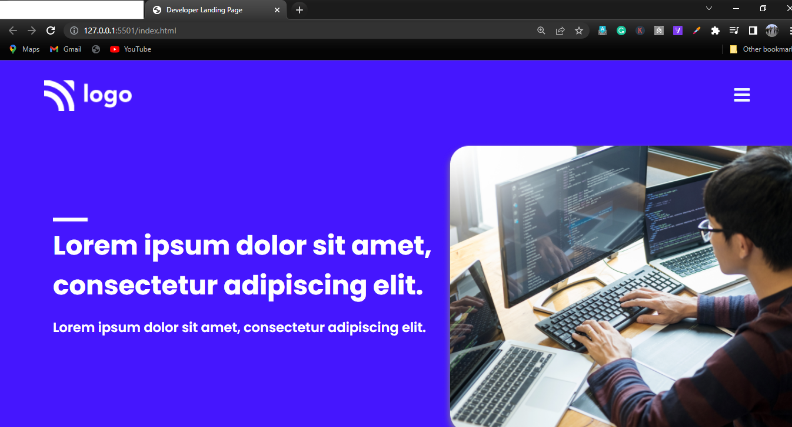
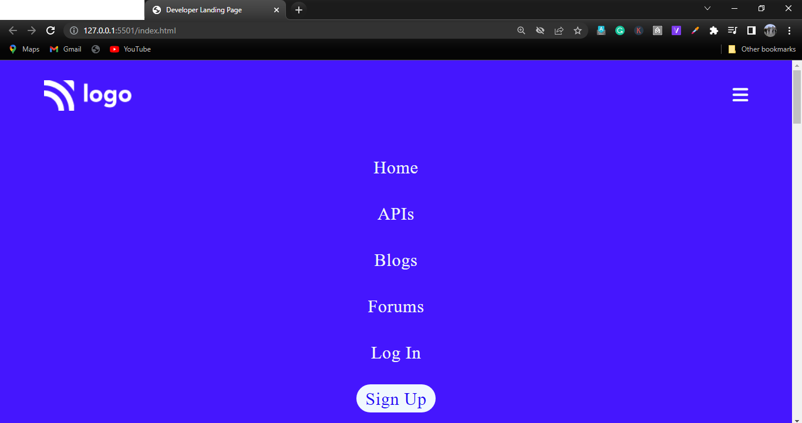

# Project 9 : Developer Landing Page

- Click here for live demo of the Project on [ NETLIFY ](https://parikshitproject9.netlify.app/ "Parikshit Project 9")

 

###  This Project is build using HTML & CSS  

<b> Note: </b>  This Project is Responisive but not to all the devices. 
 -In our Project the Media Query Targets  the particular viewport range.
 
we will get a deeper dive into the concept of Responsive Design in coming Projects.
***

 

 

>Knowledge gained :

 

### The Things i learn by doing this Project.
- This was a great experience for me because i have never made this much long Web Page till now, and i really enjoyed it.

- In this Project I use both Positions and Flex Box for aligning elements according to my requirement.

1.<b>Positions :</b> You can use the CSS position property to position elements, divs, and containers in CSS according to your needs. The great thing about the position property is that you can use it to arrange elements anywhere you want.

2.<b>Flexbox :</b>  CSS Flexbox property to arrange items without using float. This makes arranging items in the document much easier.
 

>Below are the images of the my Project :-

- <b>Image 1 </b> : Developer Landing Page :-

   

- <b>Image 2 </b> : when we shrink the Size of Page the below are the changes we can observe: 
          1. Menu Buton Appears in place of Navigation Bar.
          2. Images,Text and button size Adjusted and Colors also changes.

   

- <b>Image 3 </b> : When we click on the Menu Button the Navigation Bar Appears from left hand side and covers the screen.
 

    

***

### Time Taken To Complete This Project : 3 days

***

 

>The project is a part of the learning from  [ Sir Hitesh Choudhary's ](https://github.com/hiteshchoudhary) course on FULL STACK JAVASCRIPT WEB DEVELOPER. The idea credit is his. I have understood the concepts and learned them by building this on my own with a bare minimum reference of source code (only when my efforts couldn't clear the roadblock). The way of execution is modified as per my viewpoint whenever is necessary.

